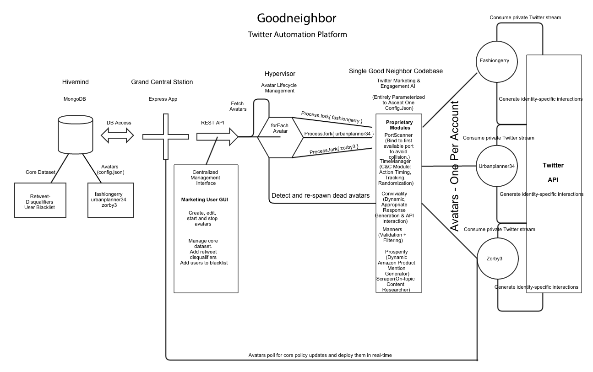
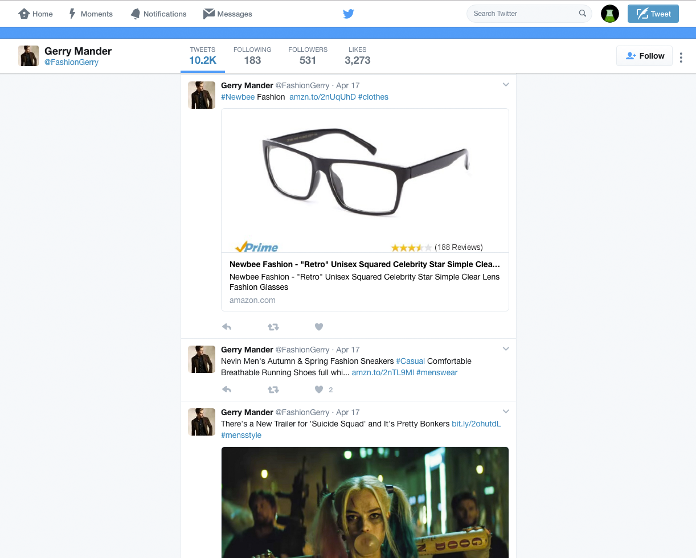
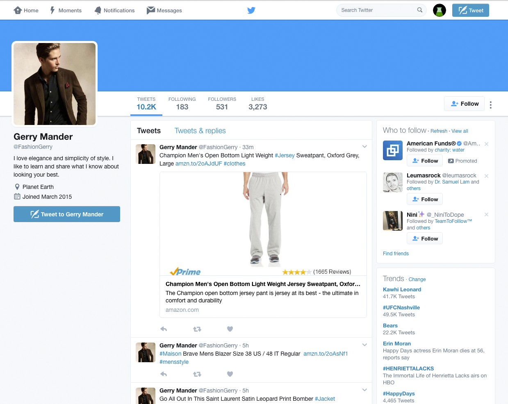
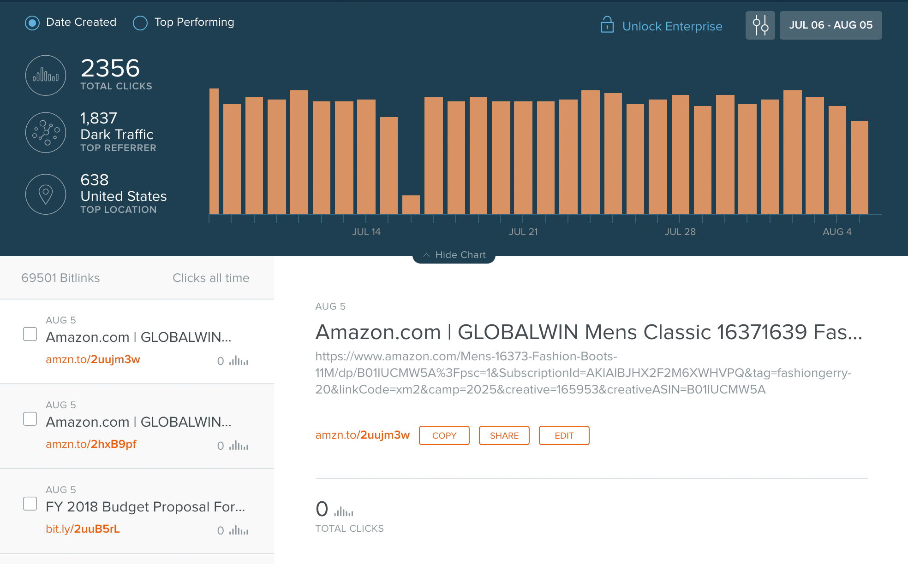

# Goodneighbor

Goodneighbor is a platform that allows you to define, run and manage Twitter avatars, totally autonomous Twitter identities that manage their own Twitter accounts, concerned with any subject matter and interested in any topic.


An avatar can run for years without human intervention.



A Twitter avatar is a Twitter account and an identity. The avatar manages the account in the same way that a social media manager would. It has interests, favorite subjects, topics it likes to research, blogs it likes to read, Twitter friends that it assists.

The avatar researches topics of interest, shares content, adds hashtags to it dynamically, retweets high quality content within its interest profile, thanks Twitter users that help it, says you're welcome to people who thank it, surfs amazon.com for products that would be of interest to its social network and formulates affiliate links to them.

Avatars are able to run for years without interruption for two reasons: 1. they are good citizens of the Twitter ecosystem. They do not spam, repeat themselves, engage in hate speech (at least the ones I ran did not), or retweet questionable content, and they do not behave with discernable or predictable regularity. 2. Goodneighbor is designed to be self-healing software.

The manager application which allows you to configure avatars on the fly also oversees the individual avatars. It knows which ones should be running and which are paused - if an avatar falls over or encounters an error it cannot itself recover from, the manager application restarts it.

## Your usage of Goodneighbor

You can use Goodneighbor for nefarious purposes. I won't be able to stop you. You can use Goodneighbor for the betterment of all sentient beings. I won't be able to assist you. You can use Goodneighbor for questionable or laudible ends. In either case, I won't be able to defend you.

## Goodneighbor Architecture at a Glance ##

Goodneighbor is written in node.js and uses mongodb as a datastore.

## System Requirements

* Docker
* Node.js
* Mongo

If you just want to build and run the provided images, you only need Docker. If you want to run the project locally in order to get a sense of how it works, or to develop against it, you will need node.js and mongo.

## Set Up

There is an install.sh script included in the root of the project to facilitate getting up and running quickly. This script will:

* Ensure you have the software required to run Goodneighbor installed
* Load the Goodneighbor production data into your local mongo instance
* Give you hints as to the next steps you should take to get a full production instance running


**N.B: This is free software that I am not providing support for.** If you want to get it running at scale in production you will need to invest some time into figuring out how it works. Please don't waste your time opening issues requesting assistance with configuration and setup because I will ignore and close them.

If you have a problem with this, please feel free to find another open-source Twitter automation platform and use that instead.

### Use Docker Compose

**The Docker compose method is only provided as a means for making it easier to see how the components fit together.** Do not attempt to use this for running a Goodneighbor instance in production because it won't work.

```
$ git clone https://github.com/zackproser/goodneighbor
$ cd goodneighbor
$ docker-compose build && docker-compose up
```

The Docker compose file describes a Grand Central Station image, which contains the manager app that in turn launches and manages avatars.

The goodneighbor-db image is a mongo image containing a dump of production data that I have accumulated over the course of running several avatars on and off for years.

The Docker compose file is provided as a convenience for seeing how the project works and getting up and running with it quickly.

If you are going to run this in production, I recommend configuring Grand Central Station as a service managed by systemctl, pm2, etc.

### Running in production

* Load the provided production data into your mongo database
* Run grand-central-station.js, correctly passing all required environment variables (look at the Dockerfile)
* Use the admin UI
* Re-configure all running avatars with your own data / settings
* Leave me alone

### Contribution guidelines ###

I am tired of working on this shit. Leave me alone.

### Background

[Read the full retrospective of this project here.](https://www.zackproser.com/blog/article/I-Open-Sourced-My-Twitter-AI-Platform-Goodneighbor)

## Features

### Manager application (Grand Central Station)

The manager application is protected by HTTP Basic Auth. The credentials are configurable by setting them in the grand-central-station Dockerfile.

The manager application allows an admin to:

* Make system-wide configuration settings that all Avatars will abide by (users to ignore and retweet disqualifiers)
* Manage individual avatars (start, stop, edit config)

Running avatars will call into Grand Central Station's API regularly (at the frequency you have defined in CONFIG_POLL_INTERVAL_MILLISECONDS). Avatars hot-swap configs that they receive from Grand Central Station.

This allows you to notice a behavior in a deployed avatar and quickly and easily make a configuration change to address it, without SSHing into any machines or needing to start and stop running avatars.

### Self recovering

You can run Grand Central Station with a process manager like systemd, or pm2 or forever. I have used all three in running it and all of them work.

Grand Central Station itself uses its Cleric library to regularly check for Avatars that have errored out and restarts them.

### Content research

You can define the rss (or atom or xml) feeds that an Avatar should read in its Scraper module configuration panel within Grand Central Station.

At the frequency you define in its scraping interval, the Avatar will read content from the feed endpoints you have configured, and store them in its mongo database for future reference.

Once an Avatar tweets a content item, it will mark it as tweeted, so that it does not repeat itself in the future.

### Social interaction

Avatars will follow other users that share high quality content that is within the Avatar's realm of interests. Avatars regularly prune the list of users they are following, who do not follow them back.

Avatars will retweet tweets that are high quality, and not profane, and they will keep track of who they most recently retweeted, so as to avoid repetitive looking behaviors.

Avatars leverage Twitter's search API in order to find these tweets, passing in one of their configured topics of interest, setting a preference for tweets with media, and specifying that returned tweets should not contain sensitive material.


Avatars check to see if other users have thanked them (usually for assisting with retweets or favorites) and respond in kind, so as to appear more intelligent. The same is true when someone else helps out the Avatar. The Avatar will check for users that retweet it and say thank you. These "thank you" and "you're welcome" messages are configurable via Grand Central Station.

Avatars share high quality content from their database, and dynamically generate hashtags and formulate status update text.

### Discretion

Avatars have the concept of "retweet disqualifiers" and "users to ignore". Retweet disqualifiers are strings that occur in other users' content. You can configure these at a global level within Grand Central Station's hivemind panel, and / or at an Avatar-specific level within the Avatar's config panel.

If one of the disqualifiers is found in a tweet that an Avatar is considering, the Avatar will discard it and not interact with it further. The logic for matching these disqualifiers is simple but effective. This system is in place to avoid embarassing gaffes where an automated spokesperson for a given brand speaks up in favor of a rival's offering, or appears enthusiastic about hate speech or terrorism, for example.

"users to ignore" is the same concept applied at a user level. It is an account-wide mute applied to a bad actor. If you add someone's account here, your Avatar will not interact with that user's content.

### Amazon Affiliate Marketing

Just as Avatars regularly read their designated content feeds, they also regularly ask Amazon's product API for items that are within their realm of interests.



When an Avatar tweets about an item, they formulate the link using configurable affiliate tracking codes. Any conversions via Twitter will result in the designated affiliate account being credited with the sale.



The frequency of advertisement tweets, and the types of items they are interested in, are configurable within the Avatar's control panel.

### Engagement metrics via Bitly

Avatars use Bitly's API to shorten links before authoring tweets that contain them. They do this so that an admin can log into Bitly and see how different content is performing.

